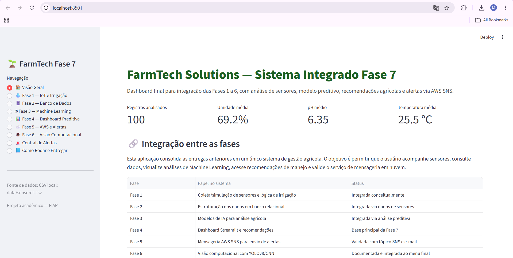
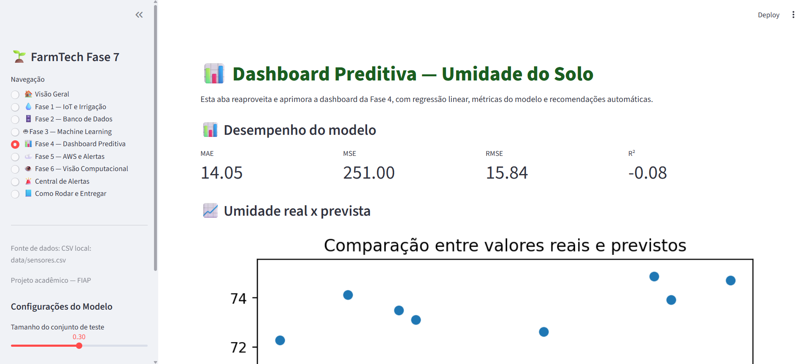
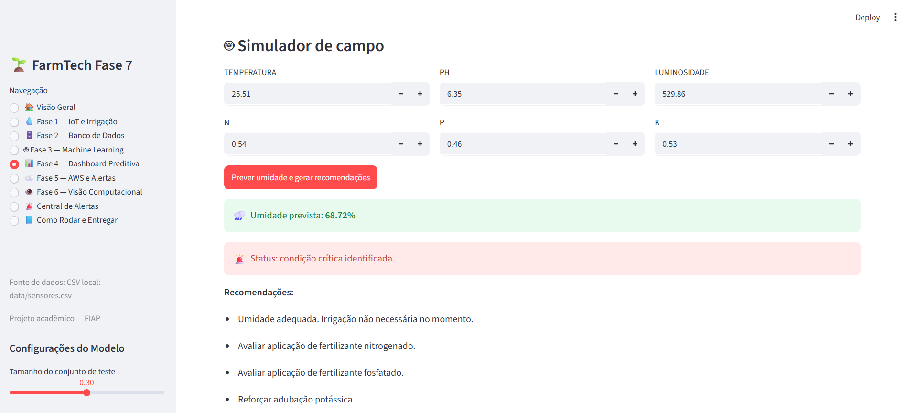
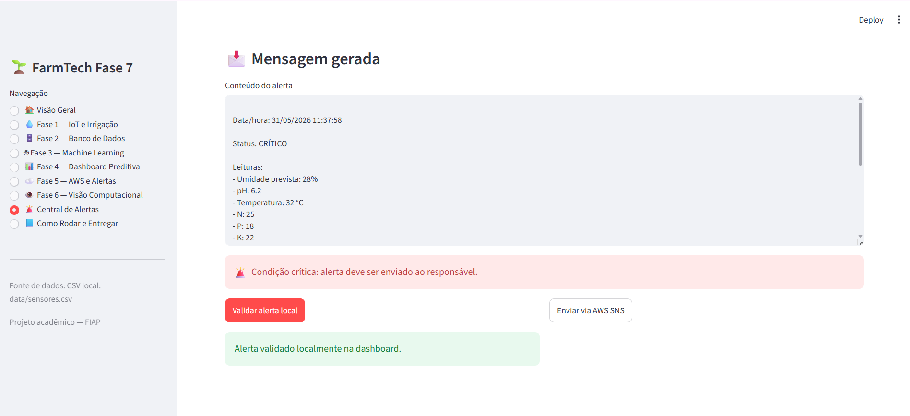
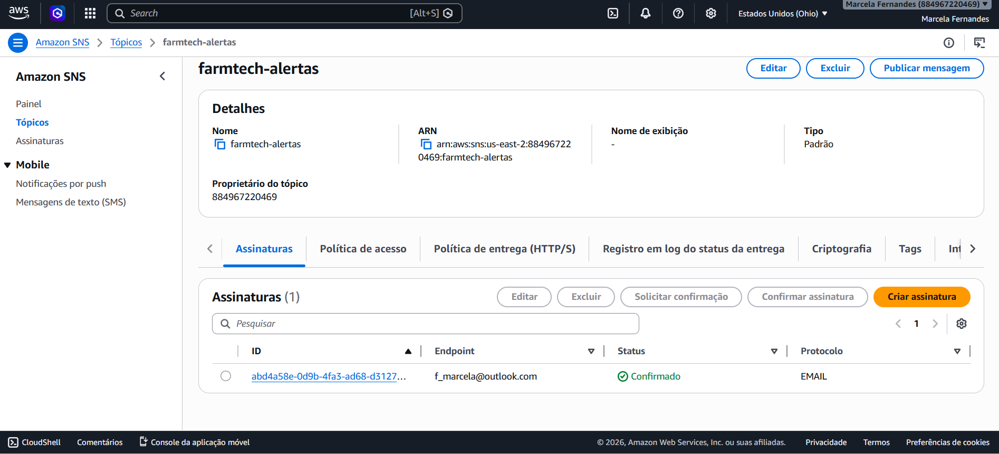
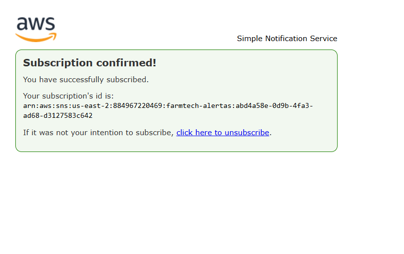
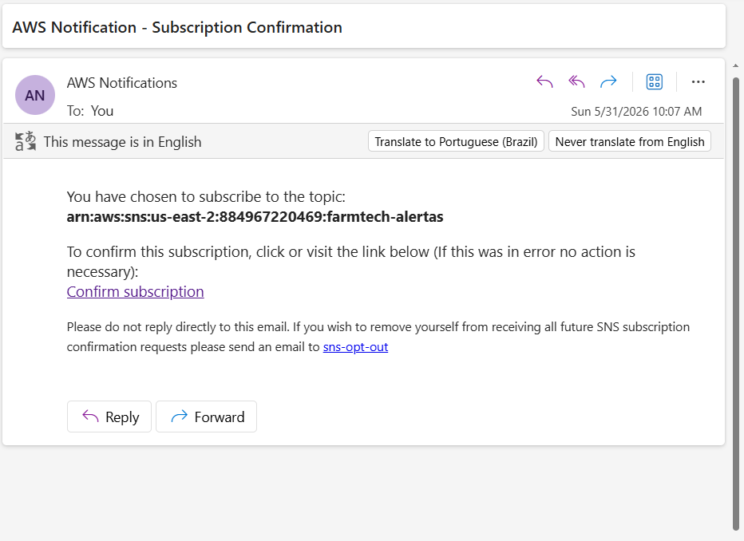
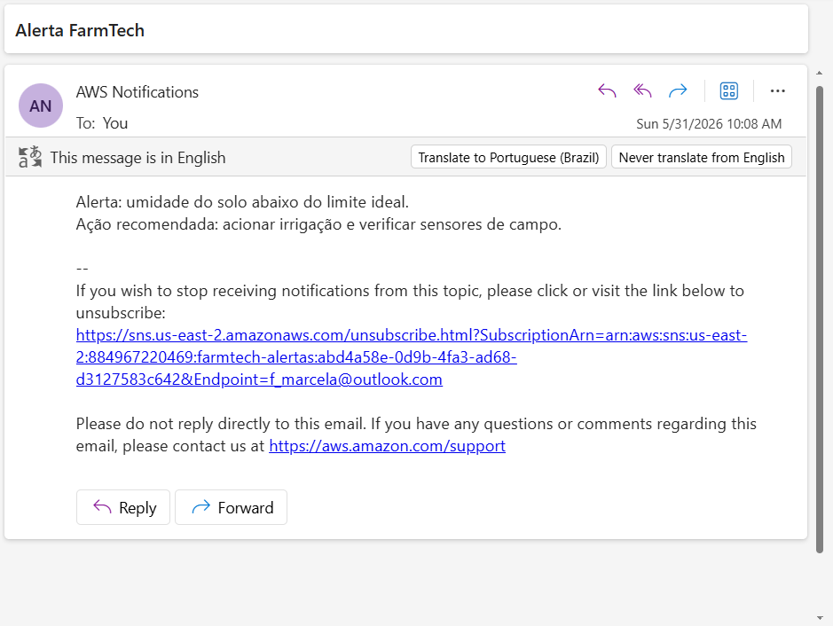

# 🌱 FarmTech Solutions — Sistema Integrado Fase 7

# 👥 Integrantes do Grupo

* Adrison Magalhães — RM: rm568165
* Sabrina Pereira Santo — RM: rm568170
* Anna Carolina Martins Souza — RM: rm566692
* Juan Battagin Barrocal — RM: rm567410
* Marcela Amorim Fernandes — RM: rm566995


# 📌 Sobre o Projeto

O projeto **FarmTech Solutions — Fase 7** consolida todas as entregas desenvolvidas nas fases anteriores em uma única solução integrada para monitoramento agrícola inteligente.

A aplicação utiliza:

* IoT e sensores agrícolas
* Banco de dados
* Machine Learning
* Dashboard interativo em Streamlit
* AWS SNS para alertas
* Visão computacional

O objetivo principal é permitir:

* monitoramento de sensores agrícolas
* análise preditiva de umidade do solo
* recomendações automáticas
* geração de alertas críticos
* centralização das entregas anteriores

---

# 🚀 Tecnologias Utilizadas

* Python
* Streamlit
* Pandas
* Scikit-Learn
* Matplotlib
* AWS SNS
* Oracle SQL
* YOLOv8
* Machine Learning

---

# 📂 Estrutura do Projeto

```bash
FarmTech_Fase7/
│
├── app_fase7.py
├── requirements.txt
├── README.md
│
├── data/
│   ├── sensores.csv
│   ├── sensores_fase4.csv
│   ├── produtos_agricolas.csv
│   ├── produtos_agricolas_fase10.csv
│   ├── seeds_dataset.csv
│   ├── crop_yield.csv
│   ├── mall.csv
│   └── moons.csv
│
├── img/
│   ├── aws/
│   └── dashboard/
│
├── fase1/
├── fase2/
├── fase3/
├── fase4/
├── fase5/
└── fase6/
```

---

# 🔗 Integração entre as fases

| Fase   | Objetivo                 | Integração                   |
| ------ | ------------------------ | ---------------------------- |
| Fase 1 | IoT e sensores agrícolas | Simulação e coleta de dados  |
| Fase 2 | Banco de dados           | Estruturação dos dados       |
| Fase 3 | Machine Learning         | Modelos preditivos           |
| Fase 4 | Dashboard Streamlit      | Interface principal          |
| Fase 5 | AWS SNS                  | Alertas agrícolas            |
| Fase 6 | Visão computacional      | Integração conceitual YOLOv8 |

---

# 📊 Dashboard Integrado

O sistema foi desenvolvido em Streamlit e consolida:

* métricas agrícolas
* previsão de umidade
* simulador de campo
* recomendações automáticas
* geração de alertas

## 🖥️ Visão Geral



---

## 📈 Dashboard Preditiva



---

## 🌾 Simulador Agrícola



---

## 🚨 Central de Alertas



---

# ☁️ Integração AWS SNS

Foi criado um tópico SNS chamado:

```bash
farmtech-alertas
```

O sistema foi validado com:

* criação de tópico
* assinatura via e-mail
* confirmação da assinatura
* envio de alerta agrícola
* recebimento do e-mail

---

## 📩 Tópico SNS



---

## 📬 Assinatura confirmada



---

## 📧 E-mail de confirmação



---

## 🚨 E-mail de alerta recebido



---

# 🤖 Machine Learning

A aplicação utiliza regressão linear para previsão de umidade do solo com base em:

* temperatura
* pH
* luminosidade
* nitrogênio
* fósforo
* potássio

Também foram utilizados datasets auxiliares:

* Seeds Dataset
* Crop Yield
* Mall
* Moons

---

# 👁️ Visão Computacional

A Fase 6 foi integrada conceitualmente ao sistema utilizando:

* YOLOv8
* classificação de imagens
* detecção de objetos agrícolas

A estrutura do projeto contém:

* imagens de treino
* validação
* teste
* labels
* notebooks

---

# ▶️ Como Executar o Projeto

## 1. Instalar dependências

```bash
pip install -r requirements.txt
```

---

## 2. Executar aplicação

```bash
streamlit run app_fase7.py
```

---

## 3. Abrir no navegador

```bash
http://localhost:8501
```

---

# 🎥 Vídeo Demonstrativo

Link do vídeo:

```bash
https://youtu.be/uRagpsgGbAE
```

---

# ✅ Conclusão

O projeto FarmTech Solutions Fase 7 consolidou conhecimentos de:

* análise de dados
* Machine Learning
* cloud computing
* dashboards
* IoT
* visão computacional

A solução permite monitoramento agrícola inteligente com geração de alertas e análise preditiva integrada em uma única aplicação.

---


[def]: img/dashboard/visao_geral.png