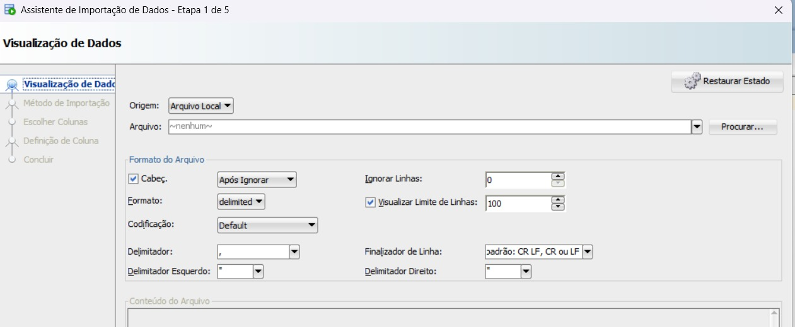
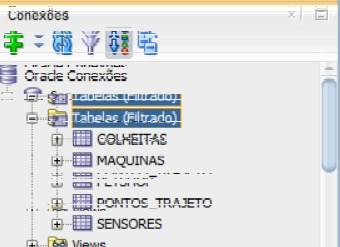
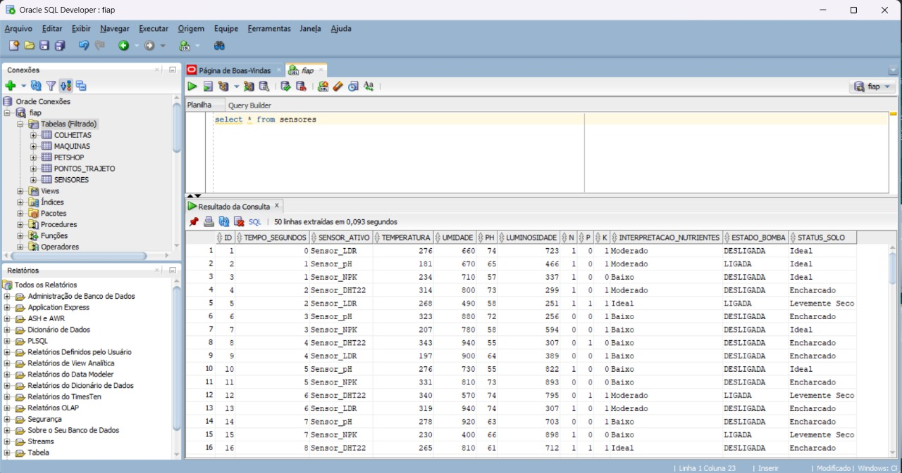

# FIAP - Faculdade de Informática e Administração Paulista

<p align="center">
<a href= "https://www.fiap.com.br/"></a>
</p>

<br>

---

## 👨‍🎓 Integrantes:
- <a href="https://www.linkedin.com/in/adrison-magalh%C3%A3es-72bab0231">Adrison Magalhães</a>  
- <a href="https://www.linkedin.com/in/anna-carolina">Anna Carolina Martins</a>
- <a href="https://www.linkedin.com/in/juan-barrocal">Juan Barrocal</a>
- <a href="https://www.linkedin.com/in/marcelaamorimfernandes">Marcela Amorim</a>
- <a href="https://www.linkedin.com/in/sabrina-santos">Sabrina Santos</a>

---

## 👩‍🏫 Professores:
### Tutor(a) 
- <a href="https://www.linkedin.com/in/sabrina-otoni-22525519b">Sabrina Otoni</a>
### Coordenador(a)
- <a href="https://www.linkedin.com/in/andregodoichiovato">Andre Godoi</a>

---

## 📁 Estrutura de pastas

Dentre os arquivos e pastas presentes na raiz do projeto, definem-se:

- <b>.cap_1</b>: Nesta pasta esta todos os arquivos necessarios para a execução do projeto.

- <b>.arquivos</b>: diretório destinado a materiais complementares e não estruturados do projeto, como planilhas de apoio, relatórios CSV, documentos auxiliares e capturas de tela usadas na documentação.

- <b>imagens</b>: pasta dedicada exclusivamente às imagens geradas automaticamente durante a execução dos notebooks, como gráficos e visualizações da análise exploratória e dos modelos preditivos.

- <b>README.md</b>: arquivo que serve como guia e explicação geral sobre o projeto (o mesmo que você está lendo agora).

---

# 🌾 Fase 3 - Capítulo 1  
### Inteligência Artificial no Agronegócio  

---

## 🚀 **Como Executar Este Projeto**

Este projeto foi desenvolvido em duas partes integradas:  
1️⃣ **Simulação IoT (geração e importação de dados)**  
2️⃣ **Machine Learning no Agronegócio (Jupyter Notebook)**  

---

## 🚀 Etapa 1 – Importação dos Dados de Sensores para o Banco Oracle

Nesta primeira parte do projeto, foi feita a **integração entre o sistema IoT (via Wokwi)** e o banco de dados **Oracle**, onde os dados dos sensores foram armazenados.

### 🔗 Fonte de dados IoT

Os dados foram gerados no simulador:  
👉 [https://wokwi.com/projects/446836538907931649](https://wokwi.com/projects/446836538907931649)

Os sensores simulam variáveis de ambiente e solo, como temperatura, umidade, pH, luminosidade e níveis de nutrientes.  
Esses dados foram exportados como **CSV (sensores.csv)** e importados para o Oracle.

### ⚙️ Processo de Importação no Oracle SQL Developer

As etapas para importar o CSV no banco Oracle estão documentadas a seguir:

#### 1️⃣ Etapa 1 – Escolha do arquivo CSV


#### 2️⃣ Etapa 2 – Seleção do esquema e criação da tabela


#### 3️⃣ Etapa 3 – Tabela criada e dados importados


Após a importação, os dados podem ser consultados com:
```sql
select * from sensores
```

---

## 🤖 **PARTE 2 – Machine Learning no Agronegócio**

### 🎯 Objetivo
Treinar e comparar modelos de Machine Learning com base na base de dados `produtos_agricolas.csv`.

---

### ⚙️ Como Executar

1️⃣ **Abra o Jupyter Notebook**  
```bash
jupyter notebook
```

2️⃣ **Abra o arquivo:**
```
sabrinaSantos_RM568170_fase3_cap1.ipynb
```

3️⃣ **Certifique-se de que a base `produtos_agricolas.csv` está na mesma pasta do notebook.**

4️⃣ **Execute célula por célula (Shift + Enter)**  
O notebook está organizado da seguinte forma:

| Célula | Etapa | Descrição |
|--------|--------|------------|
| 1 | Importação de bibliotecas | Carrega todas as dependências do projeto |
| 2 | Leitura dos dados | Importa e exibe o dataset `produtos_agricolas.csv` |
| 3–5 | Análise Exploratória | Gera 5 gráficos de distribuição e correlação |
| 6 | Perfil Ideal | Calcula o perfil ideal de solo e clima para 3 culturas |
| 7 | Preparação dos Dados | Divide a base em treino e teste |
| 8 | Treinamento dos Modelos | Treina 5 algoritmos diferentes |
| 9 | Avaliação dos Modelos | Compara acurácia e exibe tabela de resultados |

---

### 🧠 **Modelos Utilizados**
- Decision Tree  
- Random Forest  
- K-Nearest Neighbors (KNN)  
- Support Vector Machine (SVM)  
- Logistic Regression  

---

### 📊 **Resultado Final**
| Modelo | Acurácia (%) |
|--------|---------------|
| Random Forest | **99.55** |
| Decision Tree | 98.41 |
| KNN | 96.82 |
| SVM | 95.90 |
| Logistic Regression | 93.64 |

✅ **Modelo vencedor:** Random Forest  

---

### 🧾 Conclusão
O modelo **Random Forest** apresentou a maior acurácia e é o mais indicado para prever a cultura ideal conforme os parâmetros de solo e clima.  
Juntos, o simulador IoT e os modelos de aprendizado de máquina demonstram a integração prática entre **IoT e IA na Agricultura 4.0**. 🌿

---

### 🎥 **Apresentação no YouTube**
Assista à demonstração completa do projeto, com a simulação IoT, importação no Oracle e execução do modelo de Machine Learning:  
🔗 [Link do vídeo no YouTube](https://youtu.be/yebM_yKX20E) 

