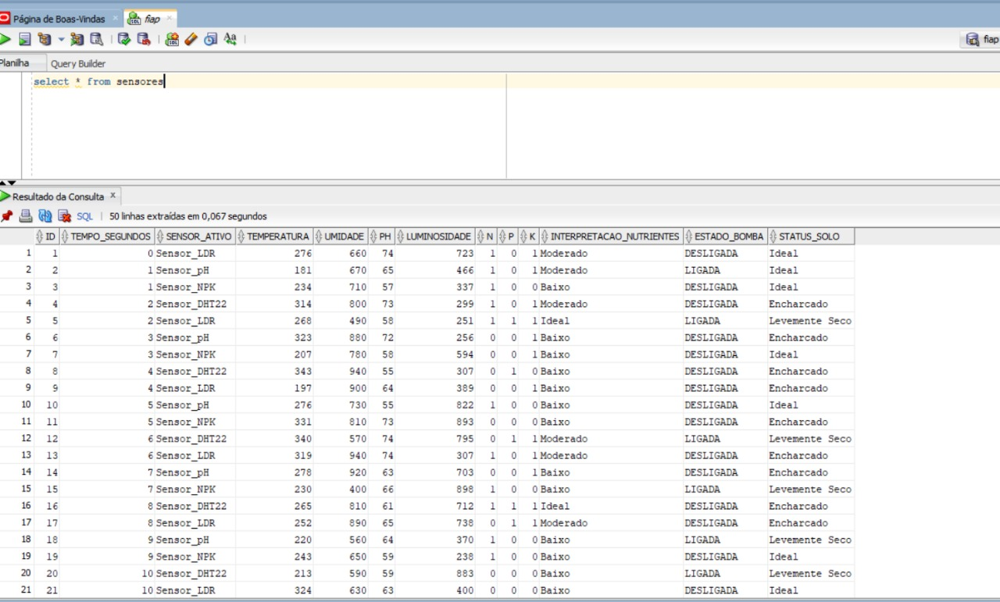

# FIAP - Faculdade de Informática e Administração Paulista

<p align="center">
<a href= "https://www.fiap.com.br/"></a>
</p>

<br>

---

## 👨‍🎓 Integrantes:
- <a href="https://www.linkedin.com/in/adrison-magalh%C3%A3es-72bab0231">Adrison Magalhães</a>  
- <a href="https://www.linkedin.com/in/anna-carolina">Anna Carolina Martins</a>
- <a href="https://www.linkedin.com/in/juan-barrocal">Juan Barrocal</a>
- <a href="https://www.linkedin.com/in/marcelaamorimfernandes">Marcela Amorim</a>
- <a href="https://www.linkedin.com/in/sabrina-santos">Sabrina Santos</a>

---

## 👩‍🏫 Professores:
### Tutor(a) 
- <a href="https://www.linkedin.com/in/sabrina-otoni-22525519b">Sabrina Otoni</a>
### Coordenador(a)
- <a href="https://www.linkedin.com/in/andregodoichiovato">Andre Godoi</a>

---

# FarmTech Solutions — Fase 4 
## Previsão de Umidade do Solo com IA

Este projeto implementa a FarmTech Solutions, com modelos de regressão para prever parâmetros agrícolas e sugerir ações de manejo a partir dos dados armazenados em banco Oracle.

---

## Objetivo
Criar modelos de Machine Learning para:
- Prever a **umidade do solo**
- Gerar **recomendações automáticas** de irrigação e fertilização
- Avaliar desempenho com métricas estatísticas
- Exibir tudo em um dashboard interativo em Streamlit

---

## Tecnologias Utilizadas
- Python 3.x
- Oracle Database
- Streamlit
- Scikit-Learn
- Pandas / NumPy
- Matplotlib / Seaborn

---

## Pipeline de Machine Learning

### 1. Coleta de Dados
Os dados são carregados diretamente do banco Oracle:
```sql
SELECT * FROM sensores
```



### 2. Pré-processamento
- Seleção das colunas numéricas relevantes
- Conversão de dados para float
- Remoção de valores nulos

### 3. Treinamento de Modelo
Modelo utilizado:
- Regressão Linear Múltipla

Fluxo:
1. Separação em treino e teste
2. Treinamento com Scikit-Learn
3. Geração de previsões

### 4. Avaliação
Métricas calculadas:
- MAE (Erro Médio Absoluto)
- MSE (Erro Quadrático Médio)
- RMSE
- R² (Coeficiente de Determinação)

### 5. Visualização
Dashboard interativo com:
- KPIs do modelo
- Gráfico Real vs Previsto
- Heatmap de correlação
- Sliders e seletores interativos

---

## Funcionalidades do Dashboard

### Previsão Manual
Permite inserir valores para:
- Temperatura
- pH
- Luminosidade
- Nitrogênio (N)
- Fósforo (P)
- Potássio (K)

Resultado:
- Previsão automática da umidade

### Recomendações Inteligentes
Geradas com base na previsão:
- Irrigação necessária
- Situação nutricional do solo
- Ações de manejo recomendadas

---

## Como Executar

1. Instale as dependências:
```bash
pip install streamlit pandas numpy scikit-learn matplotlib seaborn oracledb
```

2. Execute:
```bash
streamlit run app.py
```

---

## Entregável em Vídeo

Mostrar no vídeo:

1. Conexão com banco Oracle
2. Pipeline de Machine Learning
3. Dashboard funcionando
4. Métricas do modelo
5. Gráficos de correlação
6. Previsões em tempo real
7. Recomendações automáticas

---

## Resultado Final
Um sistema capaz de:
- Analisar solo automaticamente
- Prever umidade
- Auxiliar decisões agrícolas com IA
- Visualizar tudo em tempo real

---

**Projeto acadêmico – FarmTech Solutions**
